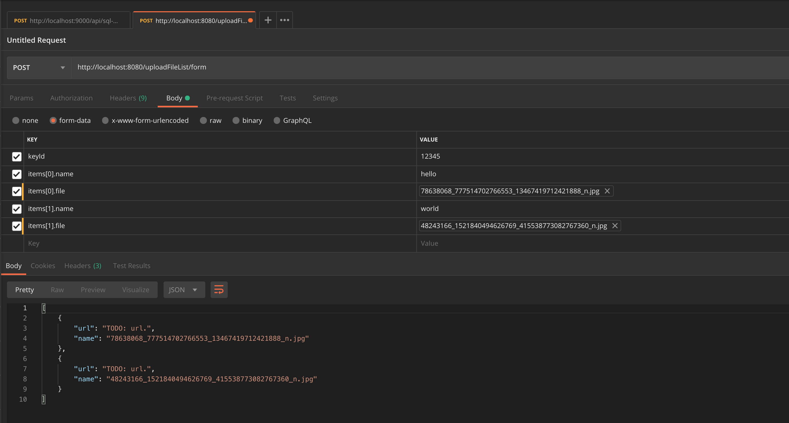

# file-upload-angular-with-spring-boot
Example File Upload by Angular into Spring boot

## Requirement

* angular cli version: `9.0.1`.
* angular version: `9.0.1`.
* node version: `v12.14.1`.
* java version: `11`.
* spring boot version: `2.1.1.RELEASE`.

## Step Run
- run angular
``` batch
$ cd frontend
$ ng serve
```

- run spring-boot
``` batch
$ cd backend
$ mvn clean spring-boot:run
``` 


## File Example
+  `frontend/src/assets/`


## References
- [listening to progress events](https://angular.io/guide/http#listening-to-progress-events)
- [File Upload in Angular 6/7 with Progress Bar Using Web API](https://www.truecodex.com/course/angular-6/file-upload-in-angular-6-7-with-progress-bar-using-web-api)


## Postman Example

#### Upload File Basic


#### Upload File Object & List

